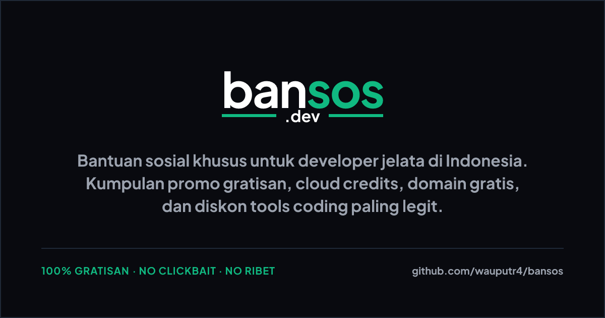

# bansos.dev

[](https://github.com/wauputr4/bansos/actions/workflows/ci.yml)
[](https://github.com/wauputr4/bansos/actions/workflows/add-bansos.yml)
[](https://www.npmjs.com/package/bansosdev)
[](LICENSE)
[](https://kit.svelte.dev/)
[](https://bansos.dev/)



`Bantuan sosial untuk developer jelata`

**bansos.dev** adalah open-source katalog info bagi-bagi berkah, promo gratisan, dan diskonan tools coding paling legit khusus untuk developer jelata di Indonesia. Dibuat biar portofolio kita-kita tetep menyala walau dompet lagi sekarat. Nyari domain gratis, hosting free-tier, cloud credits, API credits, database gratisan, atau startup credits? Di sini tempat ngumpulnya! 100% Gratisan, No Clickbait, No Ribet. fr fr 🚀

Situs ini dibangun sebagai static SvelteKit site yang super SEO-friendly, data-driven, aman di mode terang/gelap, dan gampang banget buat dikontribusikan lewat CLI atau Pull Request.

## Keyword cepat

`bansos developer`, `promo developer Indonesia`, `domain gratis`, `cloud credits gratis`, `API credits`, `hosting free tier`, `startup credits`, `developer tools gratis`, `open source Indonesia`, `SvelteKit static site`.

## Fitur utama

- Katalog bansos developer yang crawlable dan mudah dicari.
- Listing domain gratis, cloud gratis, hosting free-tier, API credits, database credits, dan benefit startup.
- Halaman detail dengan provider, benefit, syarat klaim, masa berlaku, status aktif/expired, dan link resmi.
- Filter tag dan highlight rekomendasi/terbaru.
- Data terstruktur di [`src/lib/data/bansos.json`](src/lib/data/bansos.json).
- SEO metadata untuk halaman publik, termasuk meta description dan social card pattern.
- Workflow kontribusi via `npx bansosdev add`, GitHub issue, dan Pull Request otomatis.
- Halaman kontribusi publik: [bansos.dev/contribute](https://bansos.dev/contribute).
- Terms and conditions: [bansos.dev/terms](https://bansos.dev/terms).

## Deploy dan Hosting

Situs ini di-deploy dan di-hosting menggunakan **Cloudflare Pages** dengan adapter `@sveltejs/adapter-cloudflare`. Setiap kali ada Pull Request atau push ke branch `main`/`ui-refactor`, Cloudflare secara otomatis memicu build dan mendistribusikan situs statis super cepat beserta seluruh dynamic OG image yang sudah di-prerender.


## Menjalankan proyek

```bash
npm install
npm run dev
npm run build
```

Validasi lokal:

```bash
npm run check
npm run lint
```

## Struktur penting

```text
src/lib/data/bansos.json       # data utama listing bansos
src/lib/data/bansos.ts         # helper selector, sorting, dan contributor stats
src/lib/components/            # komponen UI reusable
src/routes/list/               # halaman list dan detail bansos
src/routes/contribute/         # panduan kontribusi publik
scripts/add-bansos.mjs         # script lokal tambah data
packages/bansosdev-cli/        # CLI npx bansosdev
.github/workflows/             # CI, add-entry automation, publish CLI
```

## Cara Menambah Bansos

Ada 3 opsi utama yang bisa kamu pilih untuk mendaftarkan info bansos developer baru, sesuai dengan kenyamananmu:

### 1. Opsi 1: Lewat Web Form (Paling Mudah & Tanpa Coding)
Opsi ini sangat cocok buat kamu yang ingin berbagi info dengan cepat tanpa perlu menyentuh terminal.
1. Buka halaman kontribusi di browser: **[bansos.dev/contribute](https://bansos.dev/contribute)**.
2. Isi formulir informasi bansos secara lengkap (nama bansos, provider, deskripsi, benefit, dll).
3. Klik tombol **Kirim Info**. Sistem akan secara otomatis men-generate halaman Issue GitHub dengan template yang sudah terisi.
4. Klik **Submit new issue** di GitHub. Bot Actions kami akan memproses issue tersebut dan membuatkan Pull Request secara otomatis.

---

### 2. Opsi 2: Lewat Command Line (npx CLI)
Opsi ini ditujukan buat kamu yang lebih suka bermain dengan terminal.
Kamu bisa menjalankan perintah ini untuk menjalankan wizard interaktif di terminalmu:
```bash
npx bansosdev add
```
CLI akan menuntunmu mengisi field demi field, lalu memberikan link instan untuk membuka Issue GitHub. Setelah disubmit, bot otomatis memprosesnya menjadi Pull Request.

*Kamu juga bisa mengirimkan data langsung menggunakan argumen CLI:*
```bash
npx bansosdev add \
  --id nama-bansos \
  --title "Nama Program Bansos" \
  --provider "Nama Provider" \
  --description "Deskripsi singkat mengenai program bansos." \
  --benefits "Benefit A|Benefit B" \
  --validity-type fixed \
  --validity-date 2026-12-31 \
  --requirements "Syarat 1|Syarat 2" \
  --cta-link "https://link-resmi.com" \
  --tags "Cloud,Domain"
```

---

### 3. Opsi 3: Lewat Git Clone (Manual Pull Request)
Opsi ini bagi kamu yang ingin menguji kode secara lokal atau memodifikasi file secara langsung.
1. Clone repositori ini ke komputermu:
   ```bash
   git clone https://github.com/wauputr4/bansos.git
   cd bansos
   npm install
   ```
2. Tambahkan data secara lokal menggunakan helper script:
   ```bash
   npm run add:bansos -- \
     --id nama-bansos \
     --title "Nama Program" \
     --provider "Provider" \
     --description "Deskripsi singkat." \
     --benefits "Benefit A|Benefit B" \
     --validity-type forever \
     --requirements "Syarat 1" \
     --cta-link "https://link-resmi.com" \
     --tags "Database,API"
   ```
   Script ini akan memvalidasi data dan menyimpannya di file data terstruktur `src/lib/data/bansos.json`.
3. Buat branch baru, tambahkan commit, push ke fork, dan kirim Pull Request (PR) ke repositori utama.

---


## Panduan kualitas listing

Listing yang baik sebaiknya menyertakan:

- Link resmi provider atau halaman program.
- Benefit yang spesifik, misalnya nominal credit, durasi, atau batas kuota.
- Syarat klaim yang jelas.
- Status aktif, expired, atau upcoming.
- Tag yang membantu pencarian, misalnya `Cloud`, `Domain`, `AI Credits`, `Startup`, atau `No Credit Card`.
- Nama dan URL kontributor.

## Kontribusi

- Kirim data lewat CLI, buka issue dari URL yang muncul, lalu tunggu PR otomatis dari bot.
- Jika lebih nyaman, tambahkan melalui branch dan Pull Request manual.
- Baca panduan kontribusi lengkap di [CONTRIBUTING](https://github.com/wauputr4/bansos?tab=contributing-ov-file).

## Kode etik komunitas

Ikuti [Code of Conduct](CODE_OF_CONDUCT.md).

## Sponsor & Dukungan

Proyek `bansos.dev` dibangun secara gratis oleh komunitas. Jika proyek ini membantumu menghemat budget developer-mu, silakan pertimbangkan untuk mendukung proyek ini melalui [GitHub Sponsors](https://github.com/sponsors/wauputr4).

> [!NOTE]
> **Soon:** Kami berencana menghadirkan fitur di mana donatur/pengunjung bisa mengirimkan dukungan (donasi) langsung ke masing-masing kontributor yang mendaftarkan/menulis listing bansos tersebut.

## Lisensi

MIT. Lihat [LICENSE](LICENSE).

## Contributors

<a href="https://github.com/wauputr4/bansos/graphs/contributors">
  
</a>
